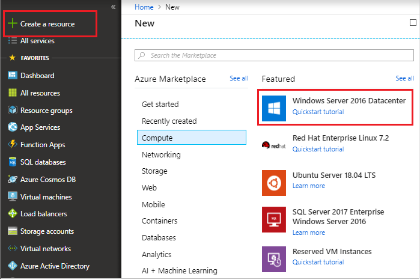
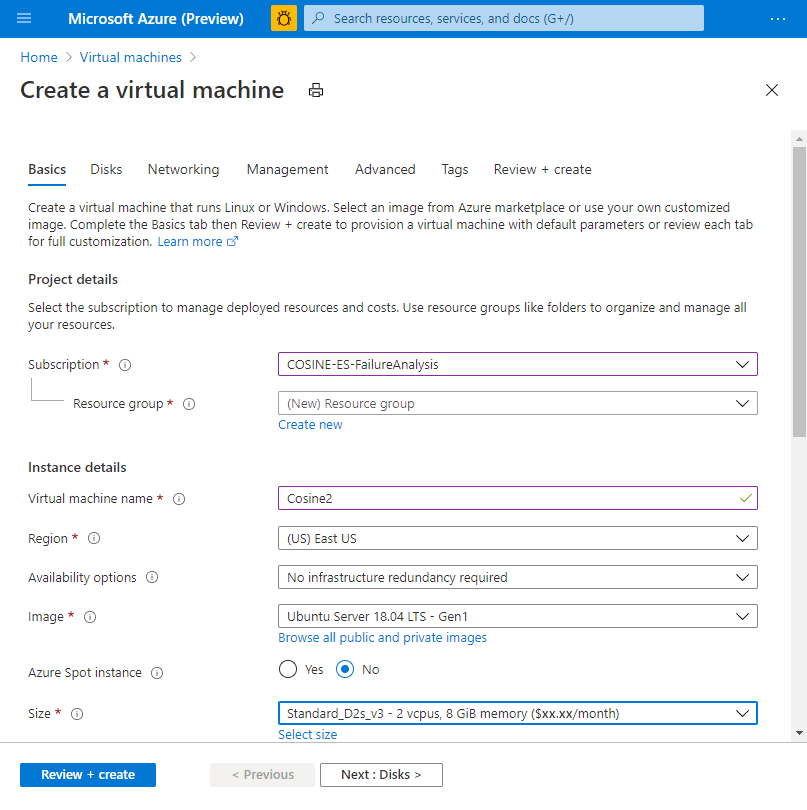
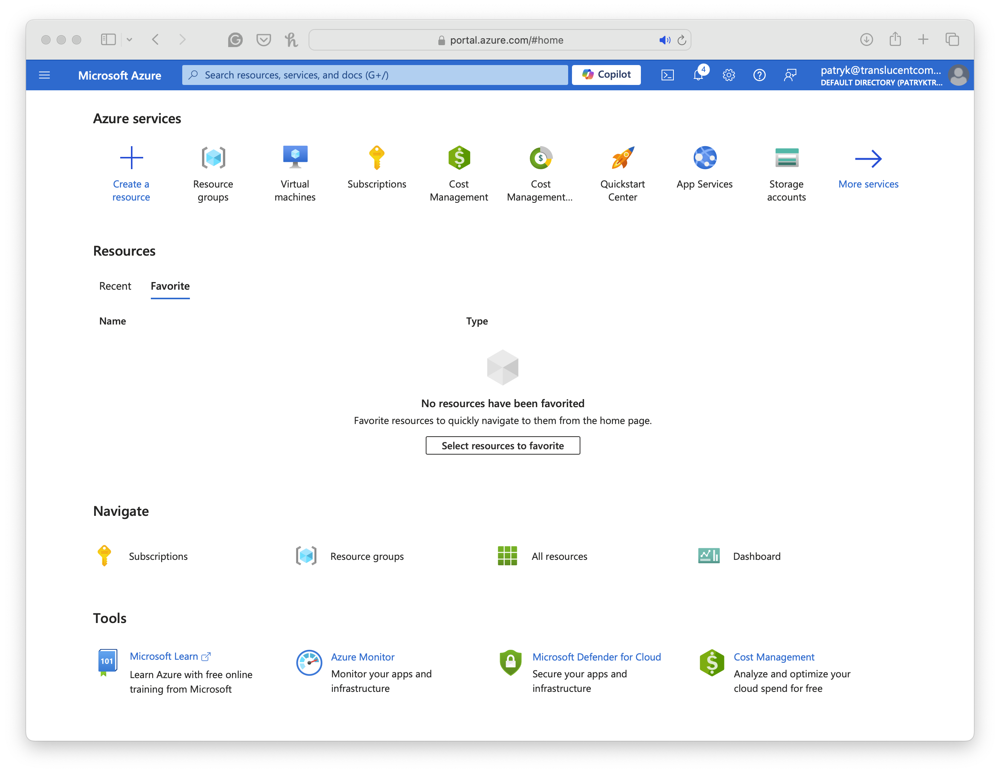

# Resumo do Lab - AZ-900: Introdução aos Conceitos Básicos do Microsoft Azure

Este repositório contém o resumo das lições aprendidas durante o desenvolvimento do lab na DIO.

---

## Computação em Nuvem

**Computação em nuvem:** é o fornecimento de serviços de computação pela internet, habilitando inovações mais rápidas, recursos flexíveis e economias de escala.

### ☁️ Nuvem Privada
- Uso exclusivo da empresa;
- Mais controle e segurança.

### 🌐 Nuvem Pública
- Compartilhada com outros usuários;
- Mais barata e escalável.

### 🔄 Nuvem Híbrida
- Combina privada e pública;
- Equilíbrio entre segurança e flexibilidade.

---

## Modelo Baseado em Consumo
- Paga só pelo que usa;
- Sem custo fixo;
- Mais controle e economia;
- Usado em serviços de computação em nuvem.

---

## Desafio DIO: Criação de Máquina Virtual no Azure (Simulado)

Este repositório simula o processo de criação de uma VM no Microsoft Azure, útil para registrar documentação técnica enquanto você adquire acesso real ao Azure.

### Etapas Simuladas
1. Acesso ao portal do Azure  
2. Criação de grupo de recursos  
3. Configuração da VM (nome, sistema, região, etc.)  
4. Revisão e confirmação  
5. (Opcional) Conexão com a VM — exibida como movimentação simulada  

---

## Capturas de Tela Ilustrativas

1. **Iniciando criação da VM**  
   

2. **Configuração básica preenchida**  
   

3. **Escolhendo o sistema operacional**  
   

4. **VM em execução no portal Azure**  
   

5. **Conta negada (exemplo de acesso negado)**  
   

---

## Tecnologias Utilizadas
- Microsoft Azure (portal)  
- Git e GitHub  
- Markdown  

---

## Referências
- Guia oficial de criação de VM no Azure  
- Exemplos e tutoriais com imagens ilustrativas  

---

## Status

Desafio documentado em modo simulado. Futuramente, substituirei as imagens por capturas reais quando tiver acesso à plataforma real.

